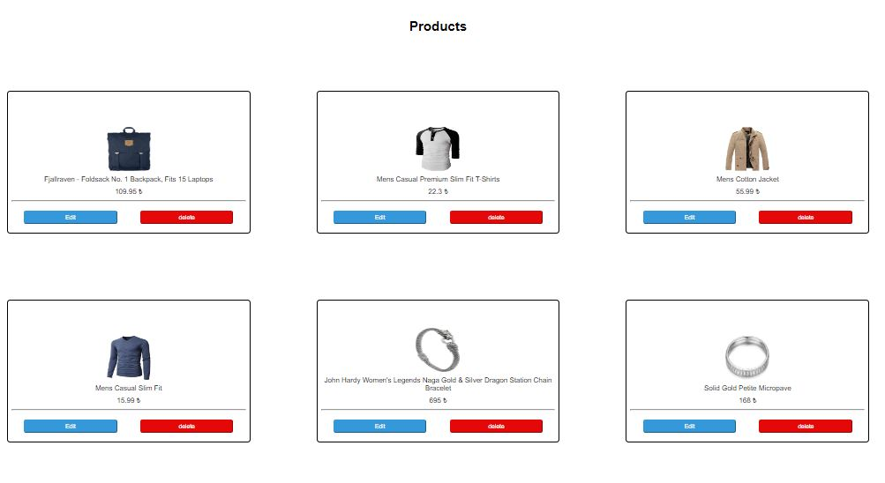
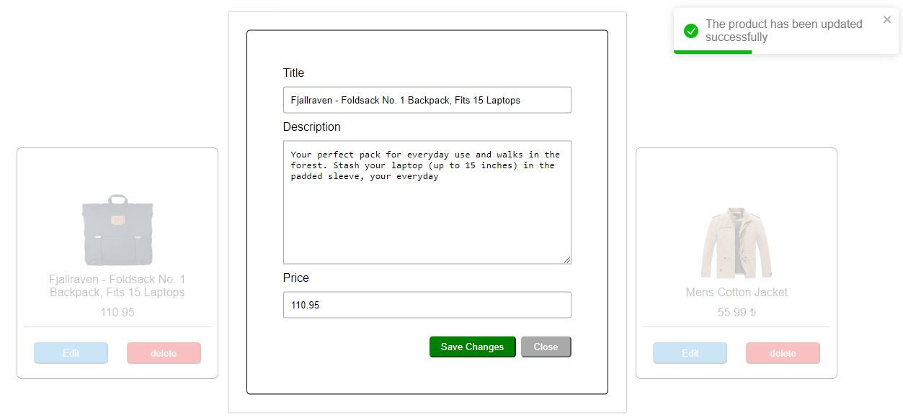
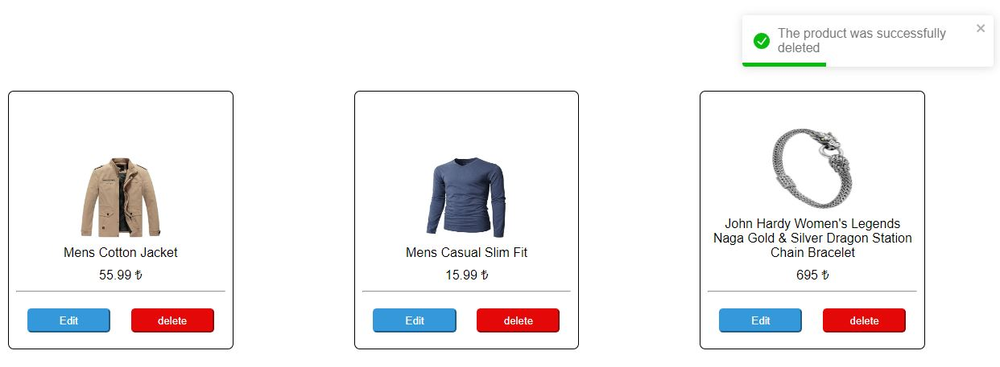

<h1>Product List App</h1>

The purpose of this project is to show the incoming products to the user by sending a request to the backend API and to enable the user to make various updates and delete operations on these incoming products.

    

      

  

